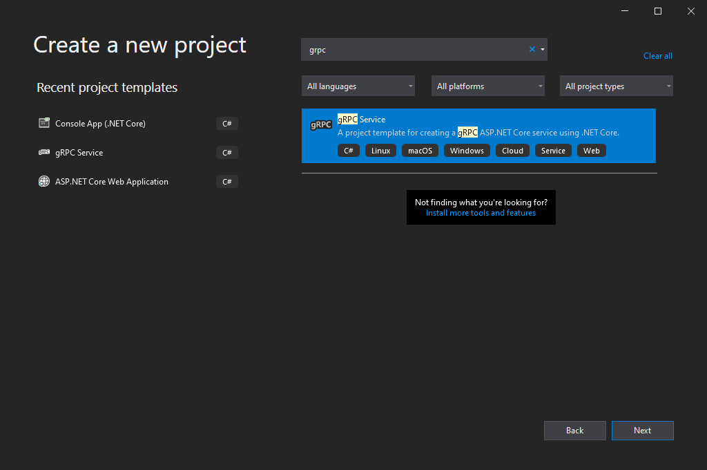
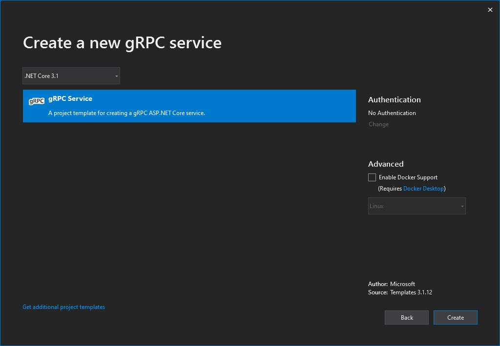
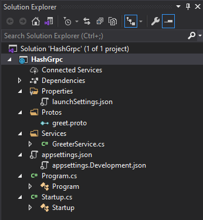
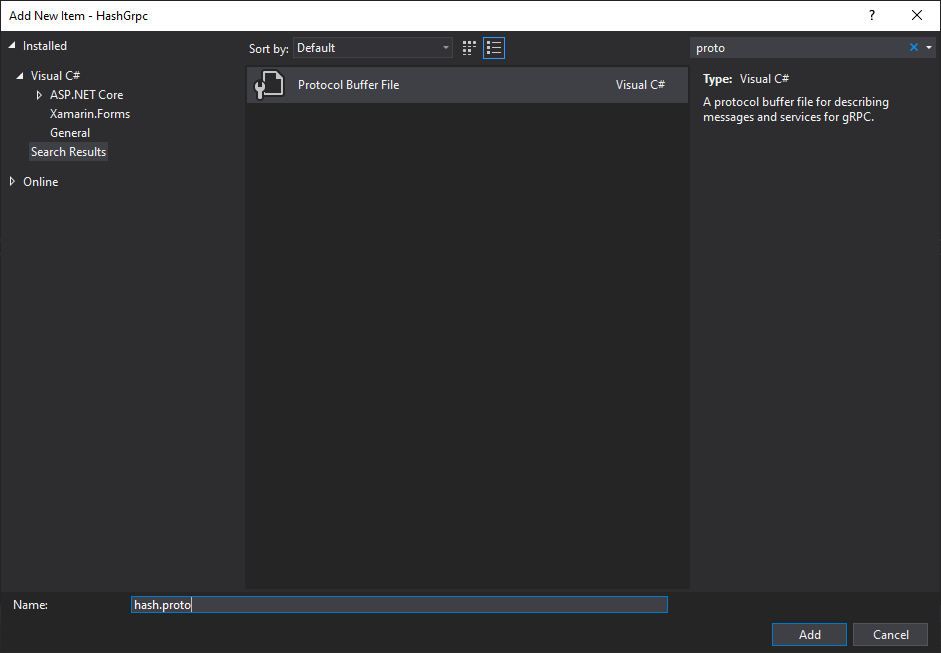

# Creating a gRPC (Micro?)Service (and Client) in .NET Core
If you're I'm assuming you've already heard about gRPC and want to see some code. In case you've not heard about it, an excerpt from [Microsoft Docs](https://docs.microsoft.com/en-us/dotnet/architecture/cloud-native/grpc#what-is-grpc):
## What is `gRPC`? 
> gRPC is a modern, high-performance framework that evolves the age-old remote procedure call (RPC) protocol. At the application level, gRPC streamlines messaging between clients and back-end services. Originating from Google, gRPC is open source and part of the Cloud Native Computing Foundation (CNCF) ecosystem of cloud-native offerings.

[Wikipedia](https://en.wikipedia.org/wiki/GRPC) defines `gRPC` as:
> gRPC (gRPC Remote Procedure Calls) is an open source remote procedure call (RPC) system initially developed at Google in 2015. It uses HTTP/2 for transport, Protocol Buffers as the interface description language, and provides features such as authentication, bidirectional streaming and flow control, blocking or nonblocking bindings, and cancellation and timeouts. It generates cross-platform client and server bindings for many languages. Most common usage scenarios include connecting services in microservices style architecture and connect mobile devices, browser clients to backend services.

Enough with the theory, let's get down with the code:
 
## How to create `gRPC` (Micro?) Service (and Clinet) using .NET?
FYI: I'm using Visual Studio 2019 in a Windows 10 Machine.

* Create a new Project using `gRPC` template.

	

* I'm using ASP.NET Core 3.1, but you may use .NET 5 as well

	

* The solution looks like this:

	

* Let's have a look at the existing `proto` file:

````protobuf
syntax = "proto3";

option csharp_namespace = "HashGrpc";

package greet;

// The greeting service definition.
service Greeter {
  // Sends a greeting
  rpc SayHello (HelloRequest) returns (HelloReply);
}

// The request message containing the user's name.
message HelloRequest {
  string name = 1;
}

// The response message containing the greetings.
message HelloReply {
  string message = 1;
}

````

## Creating new `gRPC` for creating SHA256 Hash of a given input `string`

Let's build a Hashing `gRPC` Service which takes a `string` input and returns `SHA256` hash of the input.

### Create the `proto` contract

* Add a new file under _Protos_ directory:

	

````protobuf
syntax = "proto3";

option csharp_namespace = "HashGrpc.Protos";

package hash;

service Hash {
	rpc GetHash(HashRequest) returns (HashResponse);
}

message HashRequest {
	string input = 1;
}

message HashResponse {
	string hash = 1;
}

````

Let's break it down.

1. `syntax` - Tells the current version of `Protobuf` i.e. `proto3`
2. `option csharp_namespace` - While generating `C#` code, the `namespace` used would be "HashGrpc.Protos".
3. `package` - package name for the service in `proto` file
4. `service` - Service definition. Currently our service has only 1
5. `message`